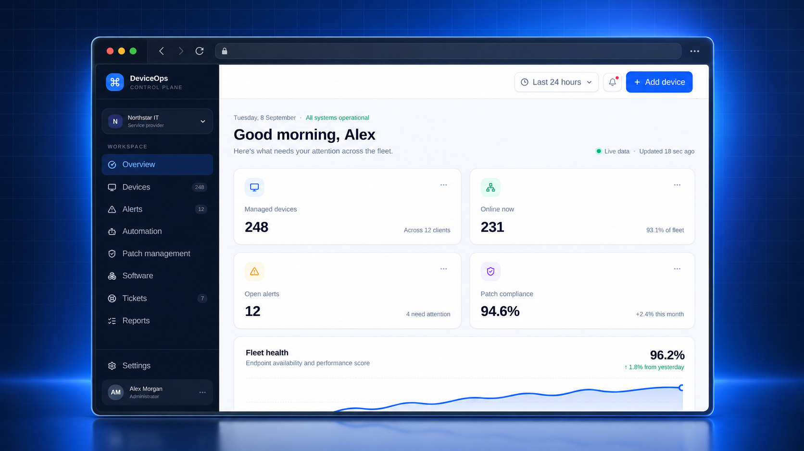
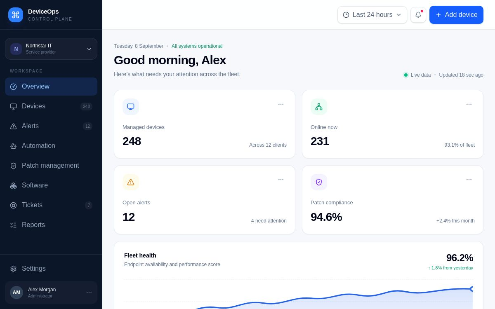
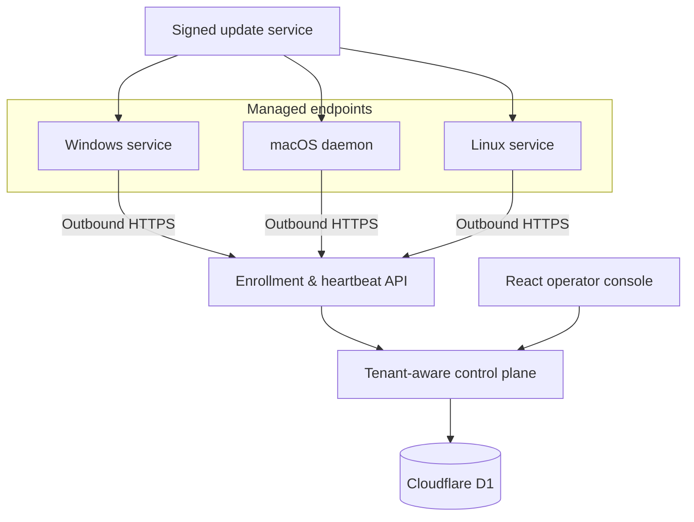

# DeviceOps — secure endpoint operations, designed end to end

**DeviceOps is an independent full-stack engineering project exploring how a modern remote monitoring and management platform can be secure by default, operationally useful, and maintainable across Windows, macOS, and Linux.**

  

## Case study

IT operators need one place to understand fleet health, enroll endpoints safely, act on alerts, and ship agent changes without turning every device into a new security liability. DeviceOps addresses that problem with a tenant-isolated control plane and outbound-only endpoint agents.

The project was developed as a vertical slice rather than a static dashboard concept: database migrations, authenticated APIs, endpoint services, cryptographic update verification, auditability, installation, rollback, and automated tests are part of the same system.

## Product experience

The first viewport is built for operational triage. It surfaces managed-device coverage, live availability, open alerts, patch posture, fleet health, device search, and enrollment. The screenshot uses representative demonstration data; it does not contain customer information.

### Implemented workflow

1. An authorized operator creates a short-lived enrollment token scoped to an organization, site, and platform.
2. The endpoint generates its own keypair and exchanges the one-time token for a revocable device identity.
3. The agent sends bounded inventory and health heartbeats over HTTPS with replay-safe sequence numbers.
4. The control plane persists telemetry, derives health, deduplicates threshold alerts, and records audited actions.
5. Signed updates are released through canary, preview, and stable rings with deterministic device assignment.
6. Each endpoint independently verifies the pinned key, P-256 signature, artifact size, and SHA-256 digest before a privileged helper applies it.
7. A failed post-install self-test restores the previous agent package automatically.

## System architecture

## Engineering decisions

| Concern | Decision | Why it matters |
|---|---|---|
| Tenant isolation | Resolve membership server-side and include organization scope in every data operation | Prevents client-controlled tenant selection and cross-tenant reads |
| Agent authentication | Return a random credential once and store only its SHA-256 hash | Limits damage from a database disclosure |
| Replay resistance | Require monotonically increasing heartbeat sequences and bounded timestamps | Rejects duplicated or delayed device messages |
| Agent footprint | Use Python 3.11 standard-library collectors and native OS service managers | Keeps installation inspectable and avoids downloaded runtime dependencies |
| Release trust | Sign canonical manifests offline with P-256 and pin public keys at enrollment | Separates release authority from artifact hosting |
| Rollouts | Deterministic device buckets across canary, preview, and stable rings | Makes staged releases repeatable instead of randomly reshuffling devices |
| Recovery | Atomic package swap followed by a CLI self-test and rollback | Preserves the last working agent after a bad release |

## Security posture

- Strict Zod contracts and 32 KB API request limits
- Expiring, single-use enrollment tokens stored as hashes
- Revocable bearer identities with no raw credential persistence server-side
- Same-origin controls and role checks for operator mutations
- Append-oriented telemetry and immutable audit events without secrets
- HTTPS enforcement and redirect refusal for credential-bearing agent requests
- Archive path, symlink, file-count, and expansion checks before privileged extraction
- Signing keys restricted to owners and administrators

## Technical stack

`React 19` · `Next.js 16` · `TypeScript` · `Vinext` · `Cloudflare Workers` · `Cloudflare D1` · `SQLite` · `Drizzle ORM` · `Zod` · `Python 3.11` · `WebCrypto` · `P-256 ECDSA` · `systemd` · `launchd` · `Windows SCM`

## Verification

The current checkpoint passes 21 automated tests across TypeScript control-plane contracts and Python agent behavior. Coverage includes schema boundaries, credentials, redirect refusal, sequence persistence, platform collectors, canonical signatures, tamper rejection, checksum validation, and rollback after a failed update self-test. The deployable Worker build also completes successfully.

## What this project demonstrates

- Designing a secure multi-tenant product beyond the UI layer
- Building typed contracts that remain consistent across browser, Worker, database, and endpoint code
- Implementing cryptographic release controls with standard platform primitives
- Handling OS-specific service integration while sharing a portable agent core
- Treating rollback, auditing, negative authorization, and operational documentation as product features

## Current status

The monitoring foundation, three endpoint service adapters, enrollment and heartbeat APIs, and signed update path are implemented. Device detail history, credential-revocation UI, offline evaluation, notification routing, maintenance windows, and durable remote jobs are planned next. No claim is made that the demonstration represents a production customer fleet.

## Source access

The complete source repository and production demonstration are private. Access can be provided directly to prospective employers or technical reviewers when appropriate. This public repository intentionally contains only the case study and non-sensitive demonstration images.

---

Created by [Kuxornu Sylvanus](https://github.com/Achidaq) · [GitHub profile](https://github.com/Achidaq)
